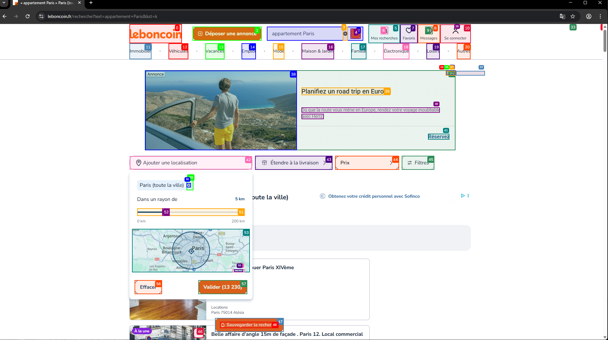

# LLM Based Scraper

An intelligent web scraper that uses **LLM-powered browser automation** to extract real estate listings from LebonCoin.fr. This tooluises Google's Gemini AI with browser automation to   parse and extract structured data from real estate listings.

  
<br>


<br>
  
<br>

##  Features

- **AI-Powered Parsing**: Uses Google's Gemini 2.5 Flash model to intelligently extract data from web pages
- **Browser Automation**: Leverages `browser-use` library for realistic browser interactions
- **Smart Data Extraction**: Automatically extracts:
  - Property prices (converted to numeric format)
  - Surface area in m²
  - Paris district (arrondissement 1-20)
- **Multiple Output Formats**: Saves data in both CSV and JSON formats
- **Error Handling**: Robust error handling and data validation
- **Jupyter Notebook Support**: Includes analysis notebook for data exploration

##   Sample Output

The scraper extracts data in this format:

```json
[
  {"price": "695000", "m2": "47", "district": "7"},
  {"price": "450000", "m2": "35", "district": "11"},
  {"price": "2990000", "m2": "162", "district": "5"}
]
```

## 🛠️ Installation

1. **Clone the repository**:

   ```bash
   git clone https://github.com/Robertoarce/Scrapper---LLM-based-with-browser_use.git
   cd Scrapper---LLM-based-with-browser_use
   ```

2. **Install dependencies**:

   ```bash
   pip install -r requirements.txt
   ```

3. **Install Playwright browsers**:

   ```bash
   playwright install
   ```

4. **Set up environment variables**:
   Create a `.env` file in the root directory and add your Google AI API key:

   ```env
   GOOGLE_AI_API_KEY=your_api_key_here
   ```

## 📦 Dependencies

- `browser-use` - AI-powered browser automation
- `python-dotenv` - Environment variable management
- `langchain-google-genai` - Google Gemini AI integration
- `playwright` - Browser automation engine

## 🚀 Usage

### Basic Scraping

Run the main scraper:

```bash
python scrapper.py
```

The script will:

1. Open a browser and navigate to LebonCoin Paris real estate listings
2. Use AI to intelligently extract property data
3. Save results to `leboncoin_listings.csv` and `leboncoin_listings.json`

 

 
## How It Works

1. **AI-Powered Navigation**: The agent uses Gemini AI to understand the webpage structure
2. **Intelligent Extraction**: The LLM identifies and extracts relevant property information
3. **Data Validation**: Ensures all extracted data meets quality criteria
4. **Format Conversion**: Automatically converts prices and areas to numeric format
5. **Structured Output**: Saves clean, structured data ready for analysis
 

##  Features

- **Automatic Scrolling**: The AI agent can scroll through multiple pages of listings
- **Error Recovery**: Built-in error handling for network issues and parsing errors
- **Data Cleaning**: Automatic removal of currency symbols, spaces, and formatting
- **Validation**: Ensures all required fields are present before saving

##   Sample Results

The scraper has successfully extracted real estate data with properties ranging from:

- **Price Range**: €540,000 - €2,990,000
- **Size Range**: 53m² - 162m²
- **Districts**: Various Paris arrondissements

## 🐛 Troubleshooting

### Common Issues

1. **Missing API Key**: Ensure your Google AI API key is set in the `.env` file
2. **Browser Issues**: Run `playwright install` to ensure browsers are properly installed
3. **Network Errors**: Check your internet connection and try again

### Debug Mode

For detailed debugging information, the script outputs:

- Raw agent results
- JSON parsing attempts
- Error traces with full stack information
 
##  License

This project is open source and available under the [MIT License](LICENSE).

##   Acknowledgments

- **browser-use** library for AI-powered browser automation
- **Google Gemini** for intelligent content understanding
- **LebonCoin.fr** for providing the real estate data source

## ⚠️ Disclaimer

This tool is for educational and research purposes. Please ensure you comply with LebonCoin's terms of service and respect rate limits when scraping data. Always check a website's `robots.txt` and terms of service before scraping.

---
 
